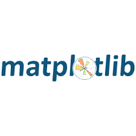

Ashitesh Singh
AI Enthusiast | Open Source Contributor

Specializing in x64 Assembly (Reverse Engineering), Python, and Machine Learning APIs. Currently focused on Generative AI using LangChain and DeepSeek, while recently contributed to TensorFlow.

Here are some of the technologies I work with:
## Languages and Tools:

  
  &nbsp;&nbsp;
  
  &nbsp;&nbsp;
  
  &nbsp;&nbsp;
  
  &nbsp;&nbsp;
  
  &nbsp;&nbsp;
  
  &nbsp;&nbsp;
  
  &nbsp;&nbsp;
  <a href="" target="_blank" rel="noreferrer">
    
   &nbsp;&nbsp;
  <a href="" target="_blank" rel="noreferrer">
    
   &nbsp;&nbsp;
  

### 📊 GitHub Activity & Stats

---

### 🏆 GitHub Trophies

---

### 👀 Visitors Counter

