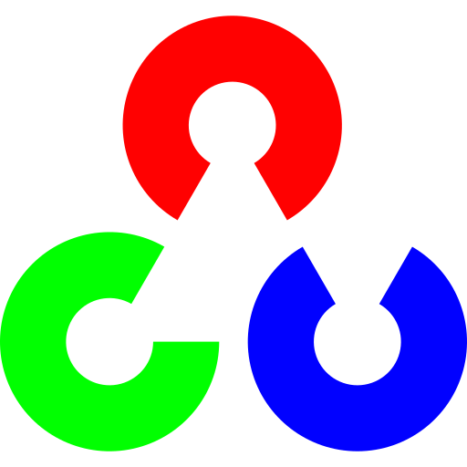

Hi there, I'm Ashitesh Singh 👋
I'm a Class 11 ISC Commerce student from India, self-teaching Machine Learning and Deep Learning to solve real-world business problems while maintaining my passion for gaming and technology innovation.

About Me
🔭 AI & Business Integration
Applying my commerce background to leverage Machine Learning and Deep Learning for solving real-world challenges and creating business efficiencies.

🎮 Developer & Gamer
Passionate gamer exploring titles like Call of Duty and GTA V Online. My gaming experience fuels my understanding of performance optimization and real-time systems—skills I'm translating into my AI projects.

🌱 Self-Taught Technologist
Everything I know about technology is self-taught, driven by curiosity and relentless hands-on experimentation. I believe learning by building is the most effective path to mastery.

🧠 Deep Learning & PyTorch Specialist
Actively expanding my expertise in PyTorch, TensorFlow, and deep learning frameworks. Specialized in Python for machine learning, working with computer vision, natural language processing, and generative AI applications.

💡 Computer Vision & GenAI Explorer
Exploring how Computer Vision and Generative AI can unlock new business opportunities, operational efficiencies, and innovative solutions in commerce and beyond.

🏆 Active Contributor & Innovator
Participating in competitive hackathons including the Viksit Bharat @2047 Buildathon and Data Science competitions. Contributing to open-source projects and sharing solutions on GitHub.
### Languages and Tools:

Here are some of the technologies I work with:

 
   
   
   
   

GitHub Stats:

Check out my GitHub activity:

<!-- These stats will automatically update based on your GitHub username -->
